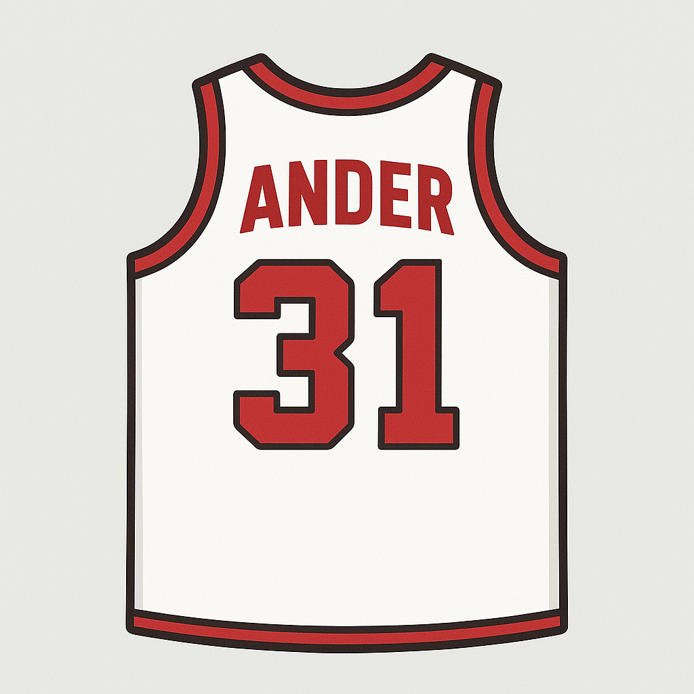
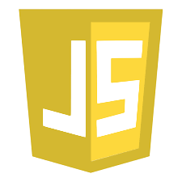
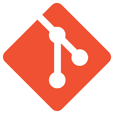
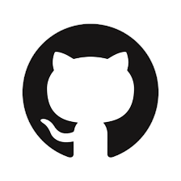

<h1 align="center">Buenas soy Ander 🏀</h1>
  

   

Soy desarrollador frontend apasionado por el baloncesto , los videojuegos y sobre todo la creacion de las paginas web.Me encanta crear webs con HTML CSS JS y aprender cosas nuevas cada día.

## 🧰 Tecnologías y herramientas

  
  
  
  
  
  
  
  
  
  
  

